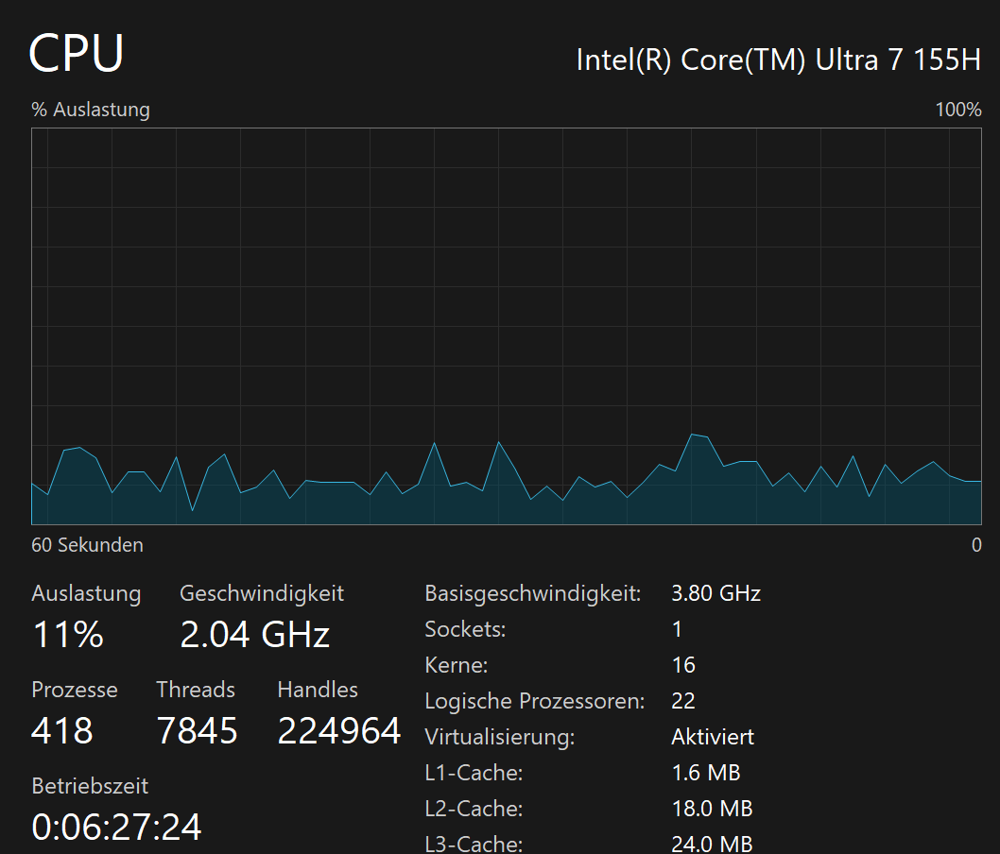

# A) Hypervisor Typ 1 und 2 (30%)

Ein **Hypervisor** ist eine Software, die mehrere virtuelle Maschinen auf einem Rechner ermöglicht.

- **Typ 1:**  
  Läuft direkt auf der Hardware, bietet hohe Leistung und Sicherheit.  
  **Einsatzgebiet:** Rechenzentren und Clouds.  
  **Beispiele:** VMware ESXi, Hyper-V.

- **Typ 2:**  
  Läuft auf einem bestehenden Betriebssystem, ist einfacher zu nutzen, aber langsamer und weniger sicher.  
  **Einsatzgebiet:** Tests und Desktop-Virtualisierung.  
  **Beispiele:** VirtualBox, VMware Workstation.

---

# B) Virtualisierungssoftware (70%)

**Vermutung:**  
Wir vermuten, dass **Hyper-V ein Typ-1-Hypervisor** ist, da er die Hardware direkt verwaltet. Dadurch können Ressourcen wie RAM und logische Prozessoren flexibel und effizient zugewiesen werden, was auf die direkte Kontrolle über das System hindeutet.

### Konfiguration RAM

 
### Konfiguration CPU

 
### Prozessor Problem

 
### Fehler RAM

 
---

Wir können versuchen, der VM mehr RAM und mehr logische Prozessoren zu geben, als das Host-System hat. Die VM stürzt dann aber ab oder zeigt eine Fehlermeldung. Das passiert, weil der Hypervisor zwar die Hardware direkt verwaltet, die VM aber trotzdem nur so viele Ressourcen bekommen kann, wie der Computer wirklich hat.

Dieses Verhalten bestätigt unsere Vermutung, dass Hyper-V ein Typ-1-Hypervisor ist. Er kann die Hardware direkt steuern und Ressourcen flexibel zuweisen. Bei einem Typ-2-Hypervisor wäre es dagegen gar nicht möglich, so viel zuzuweisen, weil das Host-Betriebssystem das Limit vorgibt.
