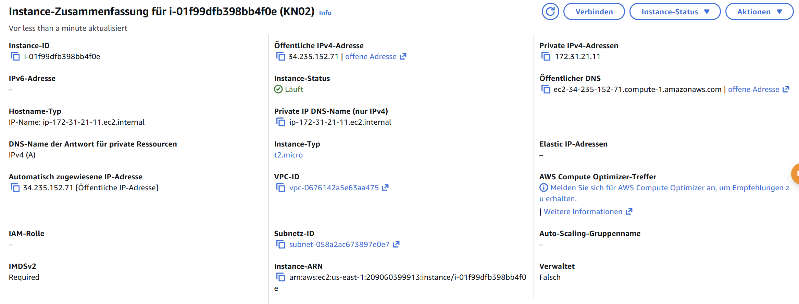
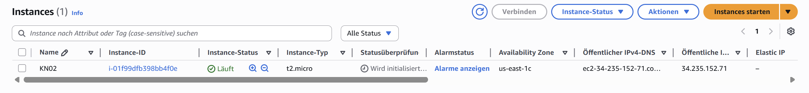

# KN02 — IaaS: Virtuelle Server (AWS EC2)

Dieser Text fasst zusammen, was ich (Nico) für das KN02‑Praktikum gemacht habe. Er dokumentiert die Arbeit mit dem AWS Academy Learner Lab, das Erstellen einer EC2‑Instanz (Ubuntu 24.04, t3.micro), sowie den Zugriff per SSH‑Key. Ich habe die Screenshots separat erstellt (Instanzenliste, Instanzdetails mit öffentlicher IP, SSH‑Versuche mit Key1 und Key2) und verweise unten, welche Screenshots als Abgabe benötigt werden.

## A) Umgang mit dem AWS Academy Learner Lab

- Ich habe die Einladung zum AWS Kurs ("Course Invitation") über das AWS Academy Learner Lab angenommen und eine Umgebung gestartet.

## B) EC2‑Instanz erstellen (Kernauswahl)

Dies sind die Einstellungen zu meiner Instanz:

- Name: KN02
- Betriebssystem: Ubuntu 
- Instanz‑Typ: t3.micro
- Key‑Pair: Ich habe zwei Keys erstellt, `Nico1` und `Nico2`.Ich habe dann `Nico1` ausgewählt.
- Die anderen Einstellungen habe ich gelassen.

Konkrete technische Angaben (Annahmen erklärt):

- Diskgrösse: 8 GB
- Betriebssystem: Ubuntu
- RAM: t3.micro hat 1 GB RAM
- CPUs (vCPU): t3.micro hat 2 vCPUs

## C) Zugriff mit SSH‑Key (Private/Public Key)

Erklärung der Funktionsweise (kurz):

- SSH verwendet ein asymmetrisches Schlüsselpaar: Private Key (auf Ihrem Gerät) und Public Key (auf dem Server).
- AWS speichert nur den Public Key in der Instanz (in Linux üblicherweise in `/home/ubuntu/.ssh/authorized_keys`). Den Private Key speichert AWS nicht — Sie müssen ihn lokal sichern.
- Nur der Besitzer des passenden Private Keys kann sich typischerweise per SSH anmelden (sofern die Benutzer/Schlüssel korrekt gesetzt sind).

Typischer Ablauf (auf Windows PowerShell):

1) Private Key Datei (z.B. `Nico1.pem`) wurde beim Erzeugen des Key‑Pairs im Learner Lab heruntergeladen. Auf Windows empfehle ich, die Datei in Ihr Benutzer‑.ssh Verzeichnis zu legen, z.B. `C:\Users\Nico\.ssh\Nico1.pem`.

2) SSH‑Verbindung (PowerShell / OpenSSH):

	- Erfolgreiches Login mit dem ersten, korrekten Key:
		ssh -i C:\Users\Nico\.ssh\Nico1.pem ubuntu@<öffentliche-IP>

	- Test mit dem zweiten (falschen) Key, das fehlschlägt:
		ssh -i C:\Users\Nico\.ssh\Nico2.pem ubuntu@<öffentliche-IP>

	Erwartetes Ergebnis bei gültigem Key: Sie erhalten eine Shell auf dem entfernten Server (Prompt `ubuntu@...`).
	Erwartetes Ergebnis bei ungültigem Key: Fehlermeldung ähnlich `Permission denied (publickey).` oder `Authentication failed`.

3) Public Key aus Private Key extrahieren (z.B. um die .pub lokal zu sehen):

	- Auf einem Unix‑ähnlichen System / in Git‑bash / WSL:
		ssh-keygen -y -f Nico1.pem > Nico1.pub

	- Diese `Nico1.pub` enthält den öffentlichen Schlüssel (einzeilige Datei), der identisch ist mit dem, was später in `authorized_keys` steht.

4) Dateirechte / Sicherheit:

	- Unter Linux/WSL: `chmod 400 Nico1.pem` empfiehlt sich, damit nur der Besitzer Leserechte hat.
	- Unter Windows (PowerShell + OpenSSH) ist das Dateirechte‑Modell anders; OpenSSH auf Windows akzeptiert private Keys in der Regel, aber schützen Sie die .pem Datei trotzdem (NTFS Berechtigungen, kein Weitergeben).

5) Benutzername für Ubuntu‑Instanzen:

	- Standardnutzername für offizielle Ubuntu AMIs ist `ubuntu`. Daher lautet der SSH‑Befehl `ubuntu@<IP>`.

## Beispiele (PowerShell‑kompatible Zeilen)

- Login mit Key1 (erfolgreich):
	ssh -i C:\Users\Nico\.ssh\Nico1.pem ubuntu@203.0.113.45

- Login mit Key2 (scheitert):
	ssh -i C:\Users\Nico\.ssh\Nico2.pem ubuntu@203.0.113.45

- Public‑Key aus Private‑Key erzeugen (falls Sie lokal prüfen wollen; in PowerShell evtl. Git‑bash / WSL nötig):
	ssh-keygen -y -f C:\Users\Nico\.ssh\Nico1.pem > C:\Users\Nico\.ssh\Nico1.pub

Hinweis: Ersetzen Sie `203.0.113.45` durch die tatsächliche öffentliche IP Ihrer Instanz.

## Abgaben (Screenshots + kurze Angaben)

Bitte fügen Sie folgende Dateien / Screenshots bei (jeweils als Bilddatei):

1. Screenshot: Liste der Instanzen (EC2 Console) — öffentliche IP muss sichtbar sein.
2. Screenshot: Details der erstellten Instanz (zeigt Key‑Name, Security Group, Root‑EBS Grösse). Public IP muss sichtbar sein.
3. Screenshot: Terminal (PowerShell) mit dem SSH‑Befehl und dem Ergebnis für Key1 (erfolgreicher Login).
4. Screenshot: Terminal (PowerShell) mit dem SSH‑Befehl und dem Ergebnis für Key2 (fehlgeschlagener Login).

Zusätzlich als Text / Aufzählung (kurz):
- Diskgrösse: (z.B. 8 GiB — prüfen Sie Ihre Instanz und übernehmen Sie den dort angezeigten Wert)
- Betriebssystem: Ubuntu 24.04
- RAM: 1 GiB (t3.micro)
- CPUs: 2 vCPU (t3.micro)

## Persönliche Zusammenfassung (für Nico)

Ich, Nico, habe im AWS Academy Learner Lab eine EC2‑Instanz mit Namen `KN02` erstellt, das Image Ubuntu 24.04 und den Instanz‑Typ `t3.micro` verwendet. Ich habe zwei Key‑Paare namens `Nico1` und `Nico2` erzeugt und `Nico1` für die Instanz ausgewählt. Mit `Nico1` konnte ich mich via SSH (Benutzer `ubuntu`) bei der Instanz anmelden; mit `Nico2` führte der Login zu einer `Permission denied (publickey)`‑Fehlermeldung — damit ist gezeigt, dass nur der korrekte private Schlüssel Zugriff erlaubt.

Wenn Sie möchten, kann ich optional noch kurze Hinweise geben, wie Sie die Security Group öffnen (SSH Port 22) oder wie man die heruntergeladene `.pem` Datei aufbewahrt / sicher verschiebt.

---

Wenn Sie möchten, übernehme ich diese Datei als Abgabe (komplett) oder ergänze noch die exakten, bei Ihnen aufgenommenen Screenshots und die dort sichtbaren Werte (z.B. die echte öffentliche IP, die genaue Root‑Volume‑Grösse). Sagen Sie mir kurz, ob die Key‑Namen `Nico1`/`Nico2` korrekt sind oder ob ich stattdessen `nico1`/`nico2` oder andere Schreibweisen verwenden soll.

