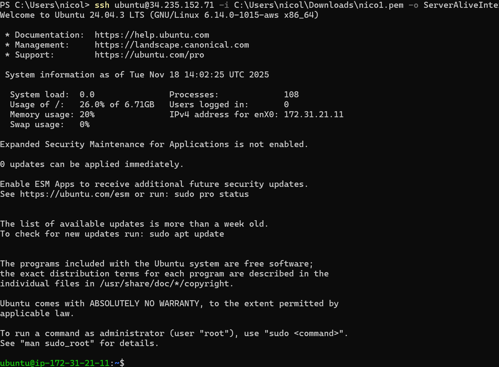
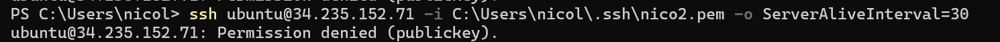

# KN02 — IaaS: Virtuelle Server (AWS EC2)

## A) Umgang mit dem AWS Academy Learner Lab

- Ich habe die Einladung zum AWS Kurs ("Course Invitation") über das AWS Academy Learner Lab angenommen und eine Umgebung gestartet.

## B) EC2‑Instanz erstellen (Kernauswahl)

Dies sind die Einstellungen zu meiner Instanz:

- Name: KN02
- Betriebssystem: Ubuntu 
- Instanz‑Typ: t3.micro
- Key‑Pair: Ich habe zwei Keys erstellt, `Nico1` und `Nico2`.Ich habe dann `Nico1` ausgewählt.
- Die anderen Einstellungen habe ich gelassen.

Konkrete technische Angaben (Annahmen erklärt):

- Diskgrösse: 8 GB
- Betriebssystem: Ubuntu
- RAM: t3.micro hat 1 GB RAM
- CPUs (vCPU): t3.micro hat 2 vCPUs

## C) Zugriff mit SSH‑Key (Private/Public Key)

1) Ich habe `Nico1.pem` ins Verzeichnis: `C:\Users\Nico\.ssh\Nico1.pem` gelegt

2) SSH‑Verbindung :

      `PS C:\Users\nicol> ssh ubuntu@34.235.152.71 -i C:\Users\nicol\Downloads\nico1.pem -o ServerAliveInterval=30`

    ### Using the right key:
    

    ### Using the wrong key:
     