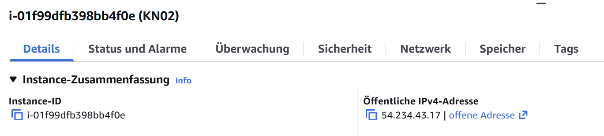
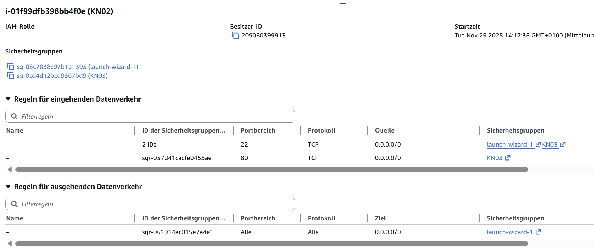
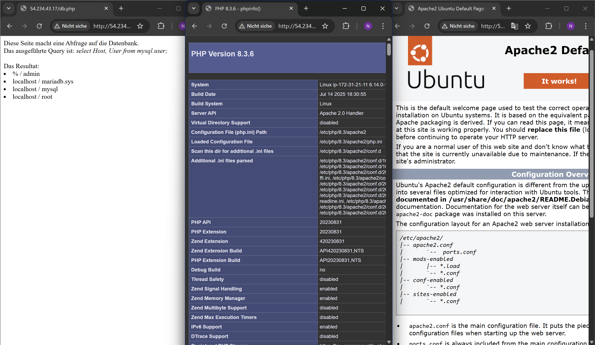
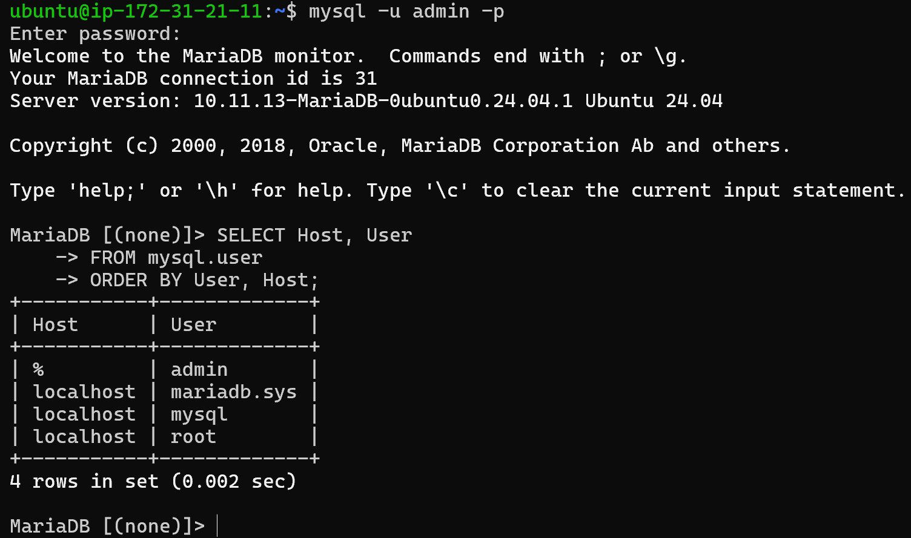

# KN03 — IaaS: Virtuelle Server (AWS EC2)

## Installieren aller Paketen

Dies sind die Details zu meiner Instanz:

Dies sind die Sicherheitseinstellungen

Im `db.php` musste ich eine Zeile verändern, ich musste bei `$password = "???";` mein Passwort einfügen.

## Verbindung

Nachdem ich alle Schritte befolgt habe und alle Einstellungen korrekt gemacht habe konnte ich auf die Websites zugreifen.

Zum Schluss habe ich mich noch in mysql angemeldet

