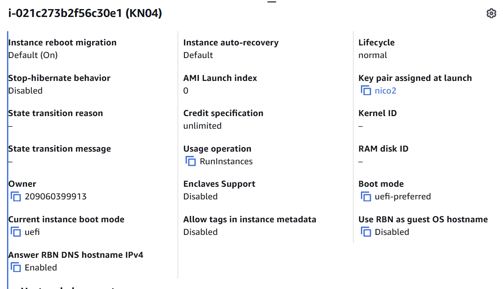
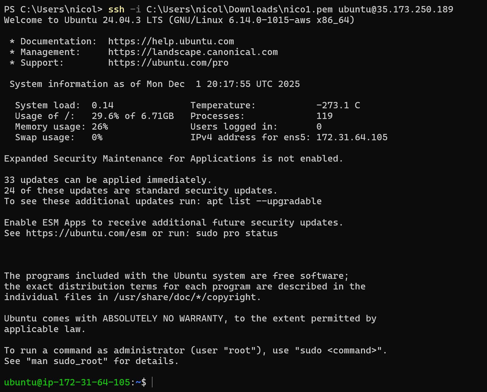
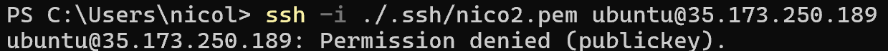
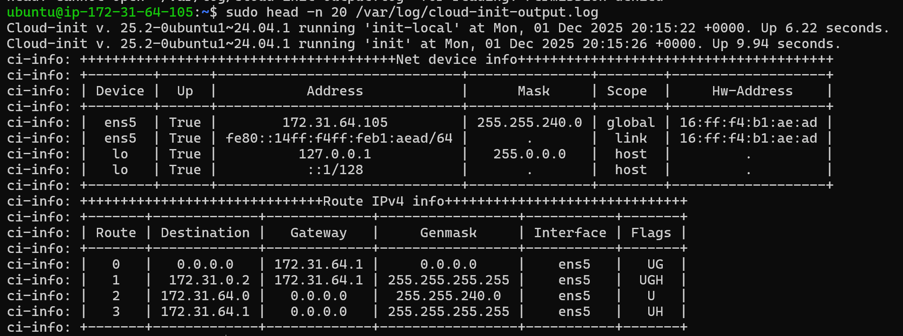
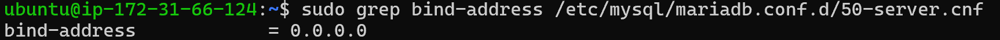
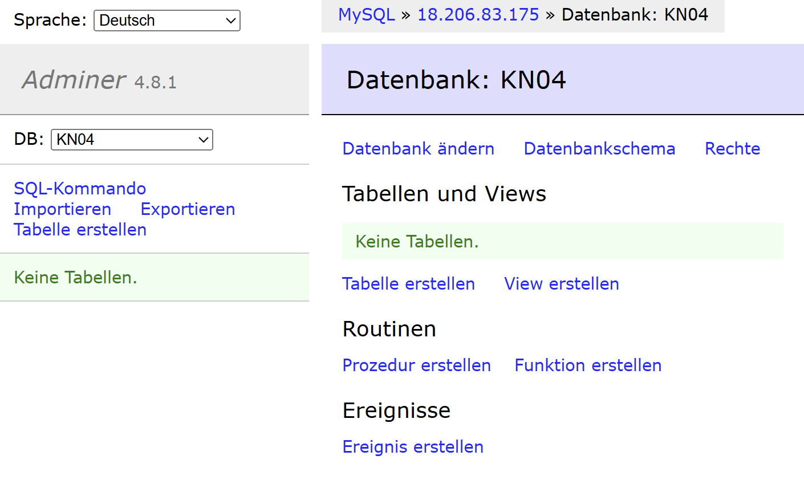
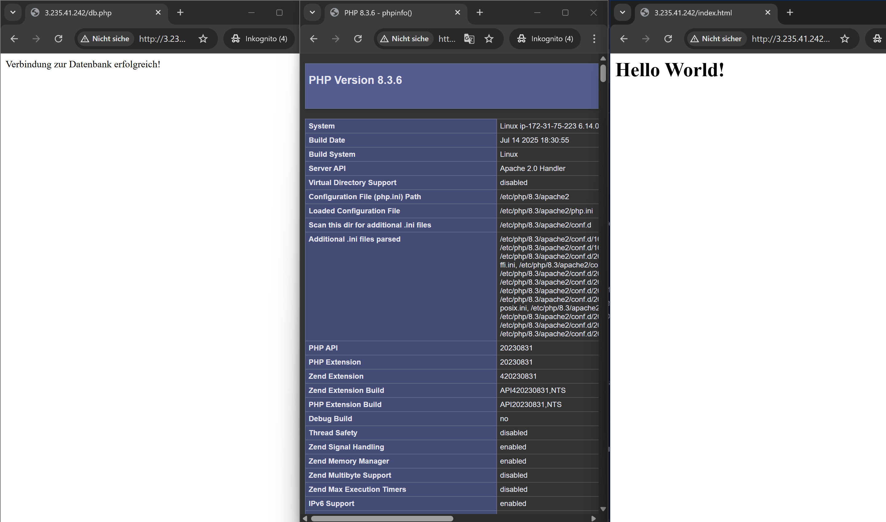

# KN04 Cloud-init und AWS

## Erstellen


Man sieht in den Details den Key 2.

So sieht meine YAML Datei aus:

```yaml
#cloud-config                     
users:                             # Benutzer
  - name: ubuntu                   # Nutzername
    groups: [users, admin]         # Gruppen
    shell: /bin/bash               # Shell
    sudo: ALL=(ALL) NOPASSWD:ALL   # Passwortloses sudo
    ssh_authorized_keys:           # SSH-Keys
      - ssh-rsa AAAAB3NzaC1yc2EAAAADAQABAAABAQDBHPGqRE3fund31MUFowXo5aDYBiMjgpI12teC//csiLM32MCgqZPvlSvWokiGPDubpBsI/HjoqxZxjOWGxEQzskD7YzpH3LLNewSZCVzkz2cgXS3+zSwkgb9Al9s21/vIQpHIHXZyRHeab+NqjvCD51zPeBTUzSNewYtTc6hiI34pGbts67ushHRwV9mwNxIFngSSI9HL1m6kq37WnIPubJKSk/XLWLSN1T1nmL+FiKbypSf7hi2vKQ9Cf2E0iVphGIxP2GYYnEZ7Gc6oFiOQnulLQlBNxU8VXDzAmKMVchFRpQVTOh+DfiXNg2c3hw2kWP6LgrJHu6hMod5ekM6z aws-key # Öffentlicher SSH-Key

ssh_pwauth: false                  # Kein Passwort-Login
disable_root: false                # Root erlaubt
package_update: true               # apt update
packages:                          # Pakete installieren
  - curl                           # curl
  - wget                           # wget

```

[cloud-init.yaml ansehen](./cloud-init.yaml)

## Einloggen

Man kann sich ohne Passwort mit Key 1 einloggen.


Man kann sich nicht mit Key 2 einloggen, er wird durch die init Datei blockiert.

Hier die ersten Zeilen des Logs:



## Template

So sieht mein Template aus:

```yaml
#cloud-config

users:
  - name: ubuntu
    groups: [users, admin]
    shell: /bin/bash
    sudo: ALL=(ALL) NOPASSWD:ALL
    ssh_authorized_keys:
      - ssh-rsa AAAA...MEINKEY... aws-key
      - ssh-rsa AAAA...TEACHERKEY... teacher-key

ssh_pwauth: false
disable_root: false

package_update: true

packages:
  - curl
  - wget

```

## Cloud DB und Web Connection

Mein DB init yaml:
[cloud-init-db.yaml ansehen](./cloud-init-db.yaml)

Mein Web init yaml:
[cloud-init-db.yaml ansehen](./cloud-init-web.yaml)

Hier sieht man noch die Bind-Addresse:


Hier sieht man noch die Adminer Verbindung:


Hier sieht man noch die drei Webseiten:
