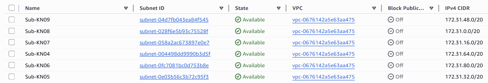
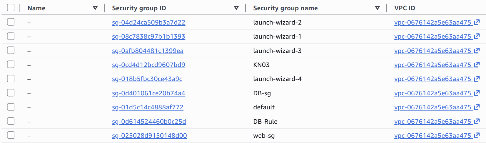
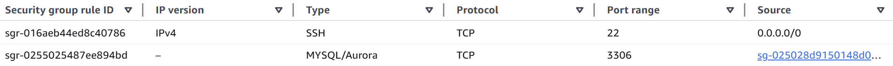
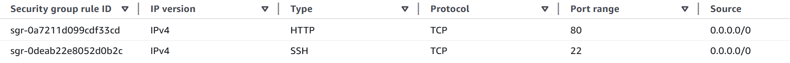
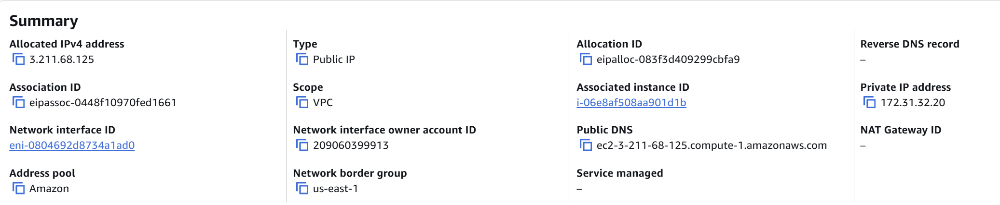

# KN05 Netzwerk / Sicherheit

## Grundbegriffe und Subnets

`VPC`: Dein eigenes privates Netzwerk in der Cloud.

`Subnetz`: Unterteilung der VPC in kleinere Bereiche.

`Private IP`: Nur intern erreichbar, nicht über Internet.

`Public IP`: Von überall im Internet erreichbar.

`Static IP`: Feste IP-Adresse, die sich nie ändert.

Hier sieht man wie ich alle Subnets bis KN09 erstellt habe.

Ich habe mich bei der DB für die IP's `172.31.32.10` & `172.31.32.50` entschieden, beim Web Service ging ich mit `172.31.32.20`& `172.31.32.100`

## Instanzen erstellen

### Security Groups

Zuerst habe ich die Security Groups erstellt.

DB:

Web Service:

### Elastic IP
Dann habe ich eine öffentliche und statische IP erstellt.

### Fertige Instanzen
Hier sieht man beide neuen Instances und ihre IP's:

