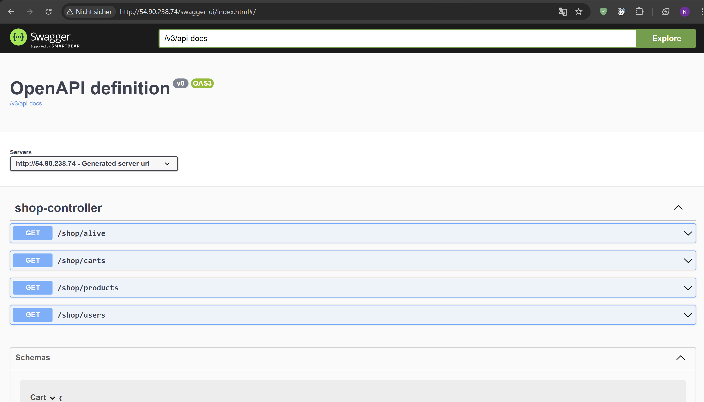
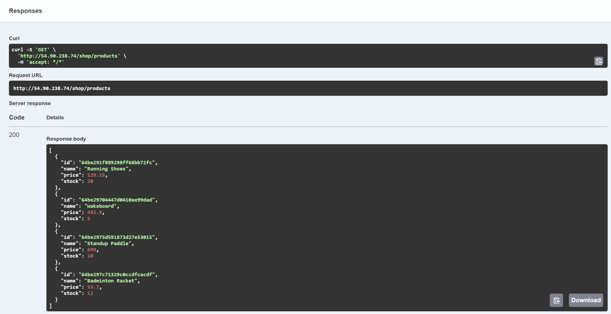
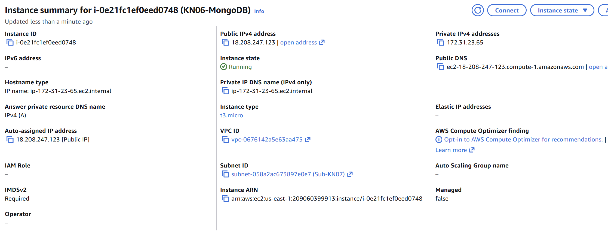
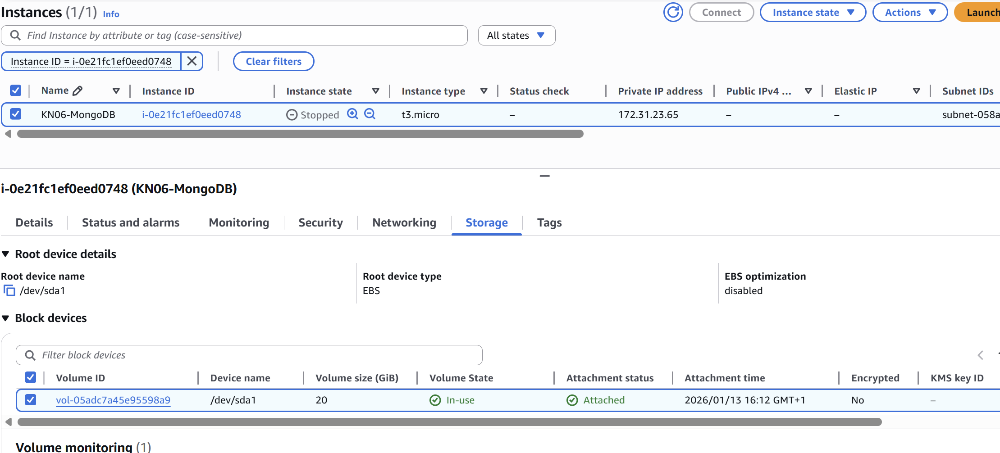
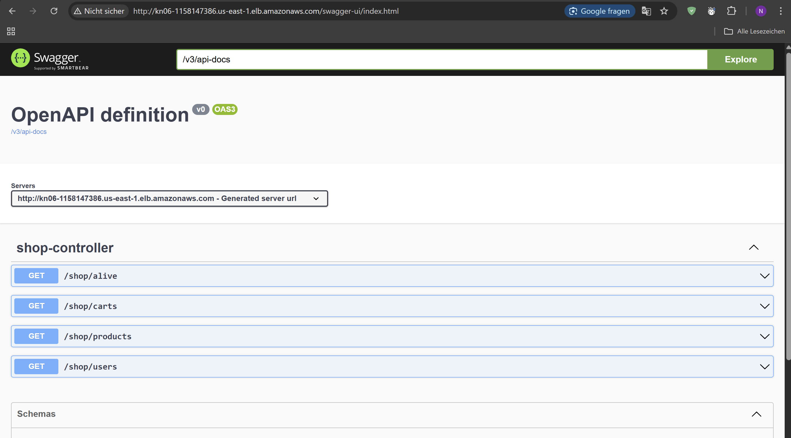
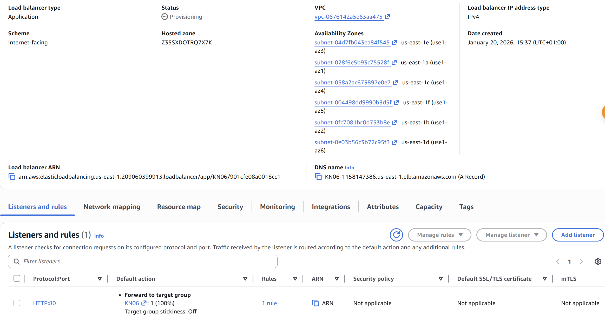

# KN06: Skalierung

## A) Installation App

### Reverse Proxy
Ein Reverse Proxy ist ein Server, der Client-Anfragen entgegennimmt und an einen oder mehrere Backend-Server weiterleitet. Er tritt nach außen als der eigentliche Endpunkt auf. Dies erhöht die Sicherheit (versteckt Backend-Struktur), ermöglicht Lastverteilung (Load Balancing) und kann Aufgaben wie SSL-Terminierung oder Caching übernehmen.

### Screenshots

Hier sieht man, dass die Swagger-URL aufgerufen werden kann:

Hier der Aufruf des products Endpoints (GetProducts) mit Resultat:

(Hinweis: Die MongoDB Collection Inhalte sind in der Ausgabe des Endpoints ersichtlich).

### Cloud-Init in produktiver Umgebung
Folgende Teile machen in einer produktiven Umgebung keinen Sinn:
- **Hardcodierte Credentials**: Passwörter und Datenbank-Verbindungsdaten sollten nicht im Klartext im Cloud-Init stehen (Sicherheitsrisiko).
- **HTTP statt HTTPS**: Die Kommunikation sollte verschlüsselt sein.
- **Fehlende Versionierung**: Es sollten spezifische Versionen der Pakete installiert werden, um Konsistenz zu garantieren.

## B) Vertikale Skalierung

### Disk Skalierung (auf 20GB)
Um die Disk zu vergrößern, geht man in der AWS Console zu "Elastic Block Store" -> "Volumes", wählt das Volume der Instanz aus und wählt "Modify Volume". Dort gibt man 20GB ein.
**Geht dies im laufenden Betrieb?** Ja, das EBS Volume kann im laufenden Betrieb vergrößert werden. Allerdings muss man danach im Betriebssystem oft noch das Dateisystem erweitern (z.B. mit `growpart` und `resize2fs`), damit der Platz nutzbar ist.

### Instanz Skalierung (auf t2.medium)
Um den Instanztyp zu ändern, muss man die Instanz zuerst stoppen ("Stop Instance"). Danach kann man über "Actions" -> "Instance settings" -> "Change instance type" den Typ auf `t2.medium` ändern und die Instanz wieder starten.
**Geht dies im laufenden Betrieb?** Nein, die Instanz muss dafür gestoppt sein.

### Screenshots Ressourcen

Ressourcen vor der Skalierung:

Ressourcen nach der Skalierung:

## C) Horizontale Skalierung

### DNS Konfiguration
Damit die Applikation unter `app.tbz-m346.ch` erreichbar ist, muss im DNS Server der Domain `tbz-m346.ch` ein Eintrag erstellt werden.
Man erstellt einen **CNAME-Record** für `app`, der auf den DNS-Namen des Load Balancers (z.B. `x.elb.amazonaws.com`) zeigt.
(Ein A-Record wäre nur möglich, wenn der Load Balancer eine statische IP hätte, was beim ALB normalerweise nicht der Fall ist).

### Load Balancer Screenshots

Swagger-Aufruf über die Load Balancer URL:

Konfiguration des Load Balancers:

## D) Auto Scaling

Ich habe ein Auto Scaling eingerichtet, das sicherstellt, dass immer mindestens 2 Instanzen laufen (maximal 5). Wenn eine Instanz ausfällt oder terminiert wird, startet das Auto Scaling automatisch eine neue, um die Zielvorgabe (Desired Capacity) wieder zu erreichen.
