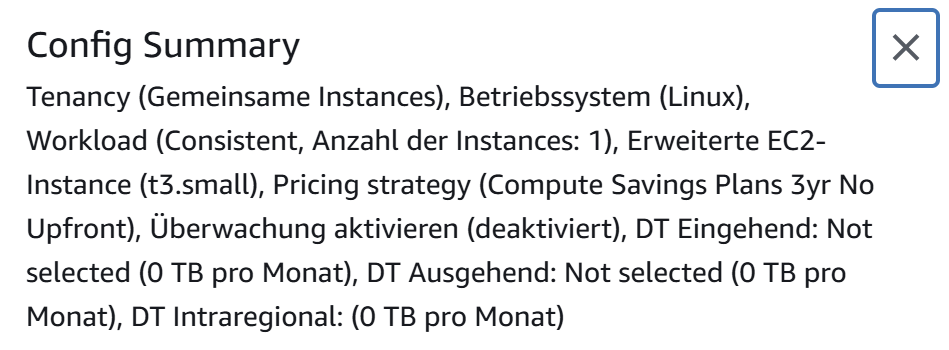
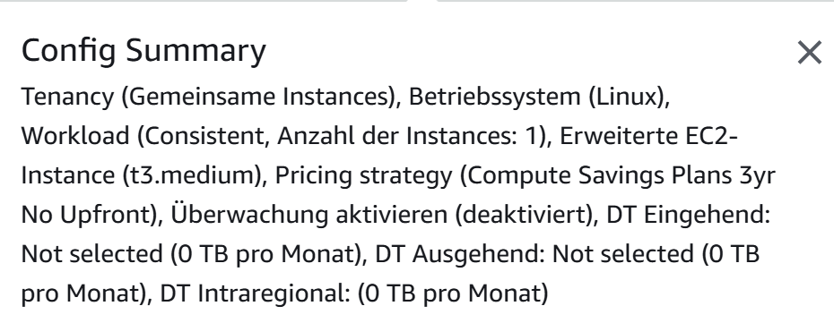
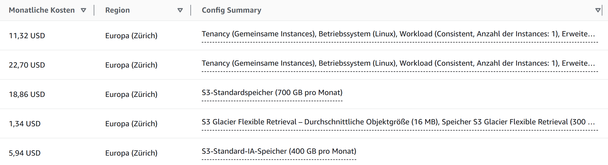
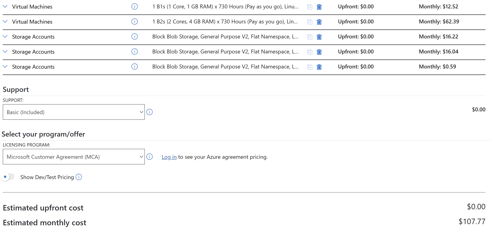
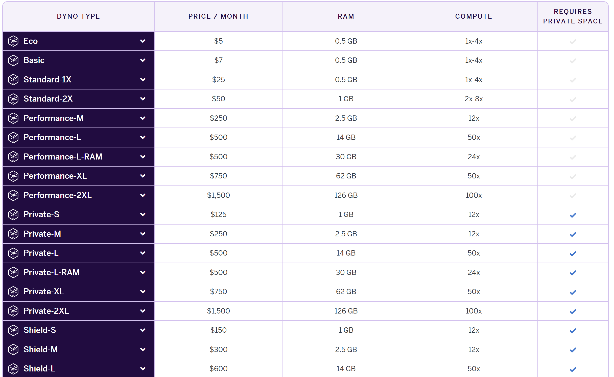
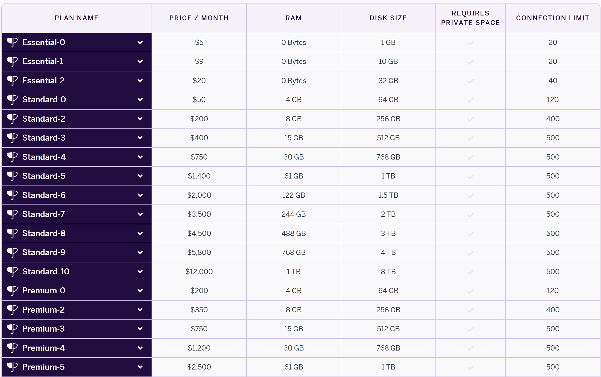
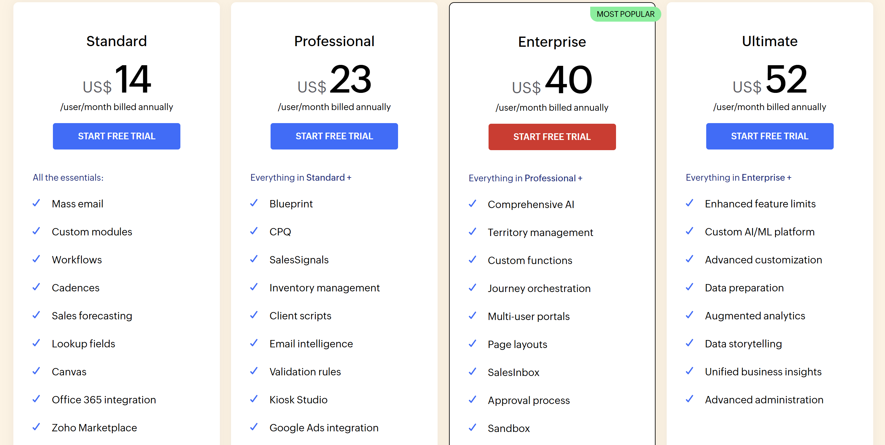
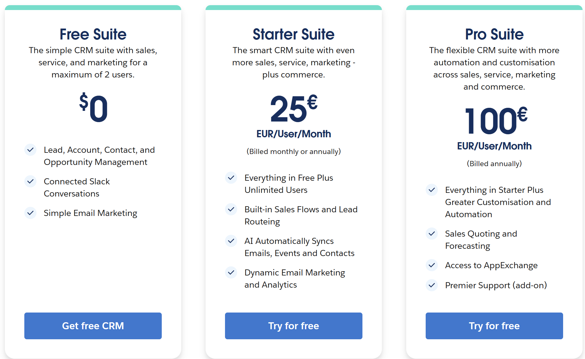

# KN10: Kostenberechnung

## A) Kostenrechnung IaaS - Rehosting (60%)

### AWS Kostenrechnung

#### Web Server

#### Datenbank Server

#### AWS Komponentenübersicht

**Auswahl der Komponenten:**
- Web Server: t3.micro (1 vCPU, 1 GB RAM) - entspricht der On-Premise Spezifikation
- DB Server: t3.small (2 vCPU, 2 GB RAM) - leicht reduziert, da Cloud-DB optimiert ist
- Storage: EBS Volumes für beide Server entsprechend den Anforderungen
- Backup: AWS Backup für tägliche, wöchentliche und monatliche Backups

### Azure Kostenrechnung

**Auswahl der Komponenten:**
- Web Server: B1s (1 vCPU, 1 GB RAM) - entspricht On-Premise
- DB Server: B2s (2 vCPU, 4 GB RAM) - entspricht On-Premise Spezifikation
- Storage: Managed Disks für beide Server
- Backup: Azure Backup für die Backup-Strategie

**Abweichungen zu On-Premise:**
- Cloud-Instanzen sind flexibler skalierbar
- Backup-Lösungen sind integriert und automatisierbar
- Keine physische Hardware-Wartung nötig

---

## B) Kostenrechnung PaaS - Replatforming (20%)

### Heroku Pricing

#### Dyno Konfiguration

#### Datenbank Service

**Auswahl der Komponenten:**
- Web Dyno: Standard-1X (512 MB RAM) - ausreichend für die Anwendung
- Database: Standard-0 (PostgreSQL) - entspricht den DB-Anforderungen
- Add-ons für Backup-Funktionalität

**Abweichungen zu On-Premise:**
- Keine direkte Kontrolle über die Infrastruktur
- Automatisches Scaling und Management durch Heroku
- Vereinfachtes Deployment, aber weniger Flexibilität

---

## C) Kostenrechnung SaaS - Repurchasing (10%)

### Zoho CRM

**Auswahl:** Professional Plan - ausreichend für 30 Benutzer mit erweiterten CRM-Funktionen.

### Salesforce Sales Cloud

**Auswahl:** Professional Plan - bietet die notwendigen CRM-Features für das Team.

**Entscheidung:** Zoho CRM Professional wurde ausgewählt, da es kostengünstiger ist und für 30 Benutzer ausreichend Features bietet.

---

## D) Interpretation der Resultate (10%)

### Kostenvergleich

Die Kosten variieren stark zwischen den Modellen:
- **IaaS (AWS/Azure):** Höhere Kosten, aber volle Kontrolle
- **PaaS (Heroku):** Mittlere Kosten, weniger Management-Aufwand
- **SaaS (Zoho/Salesforce):** Niedrigste Kosten, keine Infrastruktur-Verwaltung

**Zusätzliche Kosten:**
- Datenübertragung/Netzwerk
- Support und Wartung
- Migration und Training
- Laufende Anpassungen

Die Unterschiede sind gerechtfertigt, da verschiedene Service-Levels und Verantwortlichkeiten angeboten werden.

### Migrationsaufwand

- **IaaS:** Hoher Aufwand - komplette Migration der Anwendung, Konfiguration und Wartung
- **PaaS:** Mittlerer Aufwand - Anpassung der Anwendung an die Plattform, weniger Infrastruktur-Management
- **SaaS:** Niedrigster Aufwand - hauptsächlich Datenmigration und Einarbeitung, keine technische Wartung

